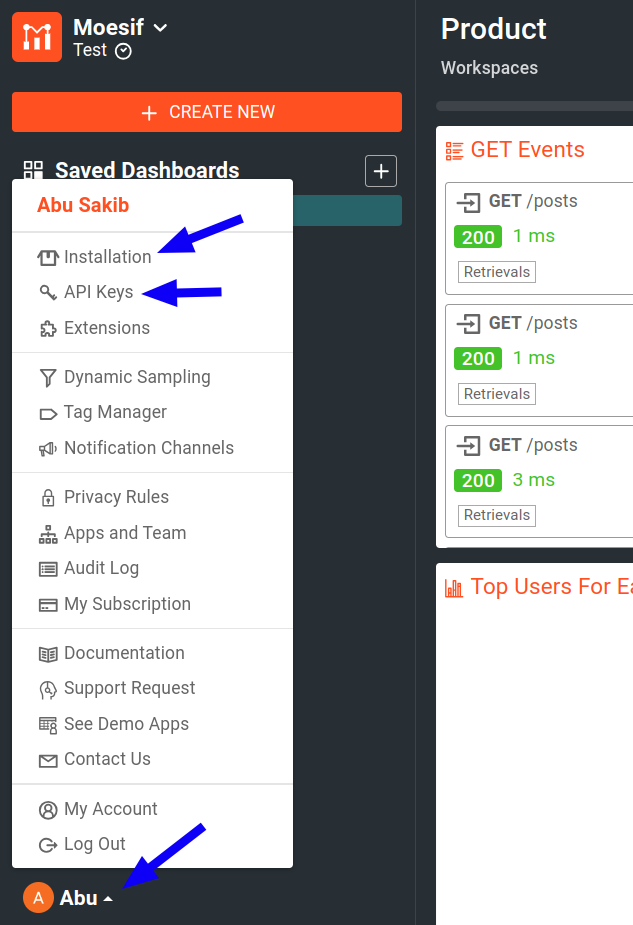

# Moesif Node.js Middleware Documentation
by [Moesif](https://moesif.com), the [API analytics](https://www.moesif.com/features/api-analytics) and [API monetization](https://www.moesif.com/solutions/metered-api-billing) platform.

[](https://nodei.co/npm/moesif-nodejs/)

[![Built For][ico-built-for]][link-built-for]
[![Total Downloads][ico-downloads]][link-downloads]
[![Software License][ico-license]][link-license]
[![Source Code][ico-source]][link-source]

Moesif Node.js middleware automatically logs incoming and outgoing API calls 
and sends them to [Moesif](https://www.moesif.com) for API analytics and monitoring.
This middleware allows you to integrate Moesif's API analytics and 
API monetization features into your Node.js applications with minimal configuration. 

> If you're new to Moesif, see [our Getting Started](https://www.moesif.com/docs/) resources to quickly get up and running.


## Notes
- Previously, this NPM package was called `moesif-express`. In version 3.0, it has been renamed to `moesif-nodejs` to reflect support for any Node.js app.
- The library can capture both _incoming_ and _outgoing_ API Calls depending on how you configure the SDK. For more information, see [the examples](#examples).
- To make sure the SDK captures request body, if you use a body parser middleware like `body-parser`, apply Moesif middleware _after_ it.

## Who This Middleware is For
The middleware works with REST APIs, [GraphQL APIs](https://www.moesif.com/features/graphql-analytics) 
(such as with [Apollo](https://www.apollographql.com/)), and more.

This SDK supports any Node.js framework including Express, Koa, and Nest.js. See [the examples](#examples) for more information.

## Prerequisites
Before using this middleware, make sure you have the following:

- [An active Moesif account](https://moesif.com/wrap)
- [A Moesif Application ID](#get-your-moesif-application-id)

### Get Your Moesif Application ID
After you log into [Moesif Portal](https://www.moesif.com/wrap), you can get your Moesif Application ID during the onboarding steps. You can always access the Application ID any time by following these steps from Moesif Portal after logging in:

1. Select the account icon to bring up the settings menu.
2. Select **Installation** or **API Keys**.
3. Copy your Moesif Application ID from the **Collector Application ID** field.


## Install the middleware
In your project directory, install the middleware as a project dependency:

```shell
npm install --save moesif-nodejs
```

## Configure the Middleware
See the available [configuration options](#configuration-options) to learn how to configure the middleware for your use case.

## How to use

The following step shows how to import Moesif for an example app using Express.js.

### 1. Import the module

```javascript
// 1. Import Modules
var express = require('express');
var app = express();
var moesif = require('moesif-nodejs');

// 2. Set the options, the only required field is applicationId.
var options = {

  applicationId: 'YOUR_MOESIF_APPLICATION_ID',

  logBody: true,

  identifyUser: function (req, res) {
    if (req.user) {
      return req.user.id;
    }
    return undefined;
  },

  getSessionToken: function (req, res) {
    return req.headers['Authorization'];
  }
};

// 3. Initialize the middleware object with options
var moesifMiddleware = moesif(options);


// 4a. Start capturing outgoing API Calls to 3rd parties like Stripe
// Skip this step if you don't want to capture outgoing API calls
moesifMiddleware.startCaptureOutgoing();

// 4b. Use the Moesif middleware to start capturing incoming API Calls
// If you have a body parser middleware, apply Moesif middleware after any body parsers.
// Skip this step if you don't want to capture incoming API calls
app.use(moesifMiddleware);
```
Replace *`YOUR_MOESIF_APPLICATION_ID`* with [your Moesif Application ID](#get-your-moesif-application-id).

If you are using babel or newer versions of Node.js, you can using more modern syntax for importing—for example, `import moesif from 'moesif-nodejs';` . If you are using ECMAScript modules (ES modules), you can try the following method:

```javascript
const moesifImported = await import('moesif-nodejs');
const moesif = moesifImported.default;
```

### 2. Enter Your Moesif Application ID
The middleware expects your Moesif Application ID in [the `applicationId` key of the Moesif initialization options object](https://github.com/Moesif/moesif-express-example/blob/a1d94eac8be14a6e52d7d6303d331eae12fc6e99/index.js#L15). 

For instructions on how to obtain your Application ID, see [Get your Moesif Application ID](#get-your-moesif-application-id).

You can hardcode your Moesif Application ID value in `applicationId`. But we highly recommend that you use a more secure option like environment variables to store your Application ID. If you set the environment variable as `MOESIF_APPLICATION_ID`, Moesif automatically picks it up without you having to explicitly specify it in the `applicationId` key.

```javascript
var moesif = require('moesif-nodejs');
const http = require('http');

var options = {
  applicationId: 'YOUR_MOESIF_APPLICATION_ID',
  logBody: true,
};

var server = http.createServer(function (req, res) {
  moesif(options)(req, res, function () {
    // Callback
  });

  req.on('end', function () {

    res.write(JSON.stringify({
      message: "hello world!",
      id: 2
    }));
    res.end();
  });
});

server.listen(8080);

```

Replace *`YOUR_MOESIF_APPLICATION_ID`* with [your Moesif Application ID](#get-your-moesif-application-id).

### 3. Call Your API

Finally, grab the URL to your API endpoint and make some HTTP requests using a tool like Postman or cURL.

## Troubleshoot
For a general troubleshooting guide that can help you solve common problems, see [Server Troubleshooting Guide](https://www.moesif.com/docs/troubleshooting/server-troubleshooting-guide/). For troubleshooting issues with capturing outgoing API calls, see [Troubleshoot Capturing Outgoing API Calls](#troubleshoot-outgoing-api-calls-capturing) 

Other troubleshooting supports:

- [FAQ](https://www.moesif.com/docs/faq/)
- [Moesif support email](mailto:support@moesif.com)

### Troubleshoot Capturing Outgoing API Calls

For instrumenting or capturing outgoing API calls, it instruments standard HTTP or HTTPs from Node.js core. 
However, some third party SDKS may use customized HTTP clients to make API calls, which may interfere with instrumentation.

Here are some tips:

- Some SDKS, like the Stripe Node.js SDK, even though they have a very customized http client, lets you swap out to a more standard HTTP client like `node-fetch`.

  ```javascript
  import fetch from 'node-fetch'; // you may have to add by `npm install node-fetch` or yarn equivalent.
  import Stripe from 'stripe';

  const stripeClient = Stripe('your secret key', {
    // basically you are using node fetch as the httpClient.
    httpClient: Stripe.createFetchHttpClient(fetch),
  });
  ```

- Turn `outgoingPatch` flag to `true` in [configuration options](#configuration-options) to make an attempt to cover non-standard HTTP client usage. However, it may not cover all cases.

  ```javascript
  {
  const moesifOptions = {
    // ... other options,
    outgoingPatch: true
  };
  ```

## Repository Structure

```
.
├── app.js
├── dist/
├── eslint.config.mjs
├── images/
├── lib/
├── LICENSE
├── package.json
├── package-lock.json
├── README.md
├── test/
└── tsconfig.json
```

## Configuration options

> **Note:** If you're using Koa, you can access the state object through `request.state`.

The following sections describe the available configuration options for this middleware. You can set these options in the Moesif initialization options object. See [the example Express.js application code](https://github.com/Moesif/moesif-express-example/blob/a1d94eac8be14a6e52d7d6303d331eae12fc6e99/index.js#L15) for an example.

### `logBody`
<table>
  <tr>
   <th scope="col">
    Data type
   </th>
   <th scope="col">
    Default
   </th>
  </tr>
  <tr>
   <td>
    <code>Boolean</code>
   </td>
   <td>
    <code>true</code>
   </td>
  </tr>
</table>
Whether to log request and response body to Moesif.

### `identifyUser`

<table>
  <tr>
   <th scope="col">
    Data type
   </th>
   <th scope="col">
    Parameters
   </th>
   <th scope="col">
    Return type
   </th>
  </tr>
  <tr>
   <td>
    Function
   </td>
   <td>
    <code>(req, res)</code>
   </td>
   <td>
    <code>String</code>
   </td>
  </tr>
</table>

A function that takes Express.js [`Request`](https://expressjs.com/en/api.html#req) and [`Response`](https://expressjs.com/en/api.html#res) objects as arguments
and returns a user ID. This allows Moesif to attribute API requests to individual unique users
so you can understand who is calling your API. You can use this simultaneously with [`identifyCompany`](#identifycompany)
to track both individual customers and the companies they are a part of.

```javascript
var options = {
  identifyUser: function (req, res) {
    // your code here must return the user id as a string. Example Below
    return req.user ? req.user.id : undefined;
  }
}
```

### `identifyCompany`
<table>
  <tr>
   <th scope="col">
    Data type
   </th>
   <th scope="col">
    Parameters
   </th>
   <th scope="col">
    Return type
   </th>
  </tr>
  <tr>
   <td>
    Function
   </td>
   <td>
    <code>(req, res)</code>
   </td>
   <td>
    <code>String</code>
   </td>
  </tr>
</table>

A function that takes Express.js [`Request`](https://expressjs.com/en/api.html#req) and [`Response`](https://expressjs.com/en/api.html#res) objects as arguments
and returns a company ID. If you have a B2B business, this allows Moesif to attribute
API requests to specific companies or organizations so you can understand which accounts are
calling your API. You can use this simultaneously with [`identifyUser`](#identifyuser) to track both
individual customers and the companies they are a part of.


```javascript
var options = {
  identifyCompany: function (req, res) {
    // your code here must return the company id as a string. Example Below
    return req.headers['X-Organization-Id']
  }
}
```

### `getSessionToken`
<table>
  <tr>
   <th scope="col">
    Data type
   </th>
   <th scope="col">
    Parameters
   </th>
   <th scope="col">
    Return type
   </th>
  </tr>
  <tr>
   <td>
    Function
   </td>
   <td>
    <code>(req, res)</code>
   </td>
   <td>
    <code>String</code>
   </td>
  </tr>
</table>

A function that takes Express.js [`Request`](https://expressjs.com/en/api.html#req) and [`Response`](https://expressjs.com/en/api.html#res) objects as arguments and returns a
session token such as an API key.


```javascript
var options = {
  getSessionToken: function (req, res) {
    // your code here must return a string. Example Below
    return req.headers['Authorization'];
  }
}
```

### `getApiVersion`
<table>
  <tr>
   <th scope="col">
    Data type
   </th>
   <th scope="col">
    Parameters
   </th>
   <th scope="col">
    Return type
   </th>
  </tr>
  <tr>
   <td>
    Function
   </td>
   <td>
    <code>(req, res)</code>
   </td>
   <td>
    <code>String</code>
   </td>
  </tr>
</table>

A function that takes Express.js [`Request`](https://expressjs.com/en/api.html#req) and [`Response`](https://expressjs.com/en/api.html#res) objects as arguments and
returns a string to tag requests with a specific version of your API.

```javascript
var options = {
  getApiVersion: function (req, res) {
    // your code here must return a string. Example Below
    return req.headers['X-Api-Version']
  }
}
```

### `getMetadata`
<table>
  <tr>
   <th scope="col">
    Data type
   </th>
   <th scope="col">
    Parameters
   </th>
   <th scope="col">
    Return type
   </th>
  </tr>
  <tr>
   <td>
    Function
   </td>
   <td>
    <code>(req, res)</code>
   </td>
   <td>
    <code>Object</code>
   </td>
  </tr>
</table>

A function that takes Express.js [`Request`](https://expressjs.com/en/api.html#req) and [`Response`](https://expressjs.com/en/api.html#res) objects as arguments and returns an object. 

This function allows you
to add custom metadata that Moesif can associate with the request. The metadata must be a simple JavaScript object that can be converted to JSON. 

For example, you may want to save a virtual machine instance ID, a trace ID, or a tenant ID with the request.


```javascript
var options = {
  getMetadata: function (req, res) {
    // your code here:
    return {
      foo: 'custom data',
      bar: 'another custom data'
    };
  }
}
```

### `skip`
<table>
  <tr>
   <th scope="col">
    Data type
   </th>
   <th scope="col">
    Parameters
   </th>
   <th scope="col">
    Return type
   </th>
  </tr>
  <tr>
   <td>
    Function
   </td>
   <td>
    <code>(req, res)</code>
   </td>
   <td>
    <code>Boolean</code>
   </td>
  </tr>
</table>

A function that takes Express.js [`Request`](https://expressjs.com/en/api.html#req) and [`Response`](https://expressjs.com/en/api.html#res) objects as arguments and returns `true`
if you want to skip the event. Skipping an event means Moesif doesn't log the event.

The following example skips requests to the root path `/`:

```javascript
var options = {
  skip: function (req, res) {
    // your code here must return a boolean. Example Below
    if (req.path === '/' || req.path === '/health') {
      // Skip logging traffic to root path or health probe.
      return true;
    }
    return false
  }
}
```

### `maskContent`
<table>
  <tr>
   <th scope="col">
    Data type
   </th>
   <th scope="col">
    Parameters
   </th>
   <th scope="col">
    Return type
   </th>
  </tr>
  <tr>
   <td>
    Function
   </td>
   <td>
    <code>(MoesifEventModel)</code>
   </td>
   <td>
    <code>MoesifEventModel</code>
   </td>
  </tr>
</table>

A function that takes the final Moesif event model, rather than the Express request or response objects, as an
argument before the middleware sends the event model object to Moesif. 

With `maskContent`, you can make modifications to headers or body such as
removing certain header or body fields.

```javascript
import _ from 'lodash';

var options = {
  maskContent: function(event) {
    // remove any field that you don't want to be sent to Moesif.
    const newEvent = _.omit(event, ['request.headers.Authorization', 'event.response.body.sensitive_field'])
    return newEvent;
  }
};
```

Moesif's event model format looks like this:

```json
{
  "request": {
    "time": "2022-08-08T04:45:42.914",
    "uri": "https://api.acmeinc.com/items/83738/reviews/",
    "verb": "POST",
    "api_version": "1.1.0",
    "ip_address": "61.48.220.123",
    "headers": {
      "Host": "api.acmeinc.com",
      "Accept": "*/*",
      "Connection": "Keep-Alive",
      "Content-Type": "application/json",
      "Content-Length": "126",
      "Accept-Encoding": "gzip"
    },
    "body": {
      "items": [
        {
          "direction_type": 1,
          "item_id": "fwdsfrf",
          "liked": false
        },
        {
          "direction_type": 2,
          "item_id": "d43d3f",
          "liked": true
        }
      ]
    }
  },
  "response": {
    "time": "2022-08-08T04:45:42.924",
    "status": 500,
    "headers": {
      "Vary": "Accept-Encoding",
      "Pragma": "no-cache",
      "Expires": "-1",
      "Content-Type": "application/json; charset=utf-8",
      "Cache-Control": "no-cache"
    },
    "body": {
      "Error": "InvalidArgumentException",
      "Message": "Missing field location"
    }
  },
  "user_id": "my_user_id",
  "company_id": "my_company_id",
  "session_token":"end_user_session_token",
  "tags": "tag1, tag2"
}
```

For more information about the different fields of Moesif's event model,
see the following table or the [Moesif Node.js API documentation](https://www.moesif.com/docs/api?javascript).

Name | Required | Description
--------- | -------- | -----------
`request` | Yes | The object that specifies the API request.
`request.time`| Yes | Timestamp for the request in ISO 8601 format.
`request.uri`| Yes | Full URI such as `https://api.com/?query=string` including host, query string, and so on.
`request.verb`| Yes | The HTTP method—for example, `GET` and `POST`.
`request.api_version`| No | API Version you want to tag this request with such as `1.0.0`.
`request.ip_address`| No | IP address of the client. If not set, Moesif uses the IP address of your logging API calls.
`request.headers`| Yes | Headers of the  request as a `Map<string, string>` object. Multiple headers with the same key name should be combined together such that the values are joined by a comma. For more information, see [HTTP Header Protocol on w3.org](https://www.w3.org/Protocols/rfc2616/rfc2616-sec4.html#sec4.2)
`request.body`| No | Body of the request in JSON format or base64 encoded binary data. To specify the transfer encoding, use `request.transfer_encoding`.
`request.transfer_encoding`| No | A string that specifies the transfer encoding of the request body sent to Moesif. If not specified, Moesif assumes the request body assumed to be JSON or text. Only supported value is `base64` for sending binary data like protocol buffers.
||
`response` | No | The object that specifies the `response message`. If not set, it implies a null response such as a timeout.
`response.time`| Yes | Timestamp for the response in ISO 8601 format.
`response.status`| Yes | HTTP response status code number such as `200 OK` or `500 Internal Server Error`.
`response.ip_address`| No | IP address of the responding server.
`response.headers`| Yes | Headers of the response as a `Map<string, string>` object. Multiple headers with the same key name should be combined together such that the values are joined by a comma. For more information, see [HTTP Header Protocol on w3.org](https://www.w3.org/Protocols/rfc2616/rfc2616-sec4.html#sec4.2)
`response.body`| No | Body of the response in JSON format or base64 encoded binary data. To specify the transfer encoding, use `response.transfer_encoding`
`response.transfer_encoding`| No | A string that specifies the transfer encoding of the request body sent to Moesif. If not specified, Moesif assumes the body to be JSON or text. Only supported value is `base64` for sending binary data like protocol buffers.
||
`session_token` | Recommended | The end user session token such as a JWT or API key, which may or may not be temporary. Moesif automatically detects the session token if not set.
`user_id` | Recommended | Identifies this API call to a permanent user ID.
`metadata` | No | A JSON Object consisting of any custom metadata to be stored with this event.


### `debug`
<table>
  <tr>
   <th scope="col">
    Data type
   </th>
   <th scope="col">
    Default
   </th>
  </tr>
  <tr>
   <td>
    <code>Boolean</code>
   </td>
   <td>
    <code>undefined</code>
   </td>
  </tr>
</table>

Set to `true` to print debug logs if you're having integration issues.


### `noAutoHideSensitive`
<table>
  <tr>
   <th scope="col">
    Data type
   </th>
   <th scope="col">
    Default
   </th>
  </tr>
  <tr>
   <td>
    <code>Boolean</code>
   </td>
   <td>
    <code>false</code>
   </td>
  </tr>
</table>

Before sending any data for analysis, automatically checks the data (headers and body) and one way
hash strings or numbers that look like a credit card numbers or passwords. Set 
to `true` if you want to implement your specific [`maskContent`](#maskcontent) function or you want to send all data to be analyzed.

### `callback`
<table>
  <tr>
   <th scope="col">
    Data type
   </th>
   <th scope="col">
    Parameters
   </th>
   <th scope="col">
    Return type
   </th>
  </tr>
  <tr>
   <td>
    Function
   </td>
   <td>
    <code>(error)</code>
   </td>
   <td>
    <code>null</code>
   </td>
  </tr>
</table>

For for internal errors. For example, if there has been an error sending events
to Moesif or network issue, you can use this to check for any issues with integration.

### `disableBatching`
<table>
  <tr>
   <th scope="col">
    Data type
   </th>
   <th scope="col">
    Default
   </th>
  </tr>
  <tr>
   <td>
    <code>Boolean</code>
   </td>
   <td>
    <code>false</code>
   </td>
  </tr>
</table>

By default, Moesif Express batches the events. Set to `true` if you want to send the API events one by one.

### `batchSize`
<table>
  <tr>
   <th scope="col">
    Data type
   </th>
   <th scope="col">
    Default
   </th>
  </tr>
  <tr>
   <td>
    <code>Number</code>
   </td>
   <td>
    <code>200</code>
   </td>
  </tr>
</table>

If batching is enabled, this defines the batch size of API events that triggers flushing of queue and sending the data to Moesif. The value of the batch size must be greater than one.

### `batchMaxTime`
<table>
  <tr>
   <th scope="col">
    Data type
   </th>
   <th scope="col">
    Default
   </th>
  </tr>
  <tr>
   <td>
    <code>Number</code>
   </td>
   <td>
    <code>2000</code>
   </td>
  </tr>
</table>

If batching is enabled, this defines the maximum wait time (approximately) in 
milliseconds before triggering flushing of the queue and sending to Moesif. The 
value must be greater than `500` milliseconds.

### `retry`
<table>
  <tr>
   <th scope="col">
    Data type
   </th>
   <th scope="col">
    Default
   </th>
  </tr>
  <tr>
   <td>
    <code>Number</code>
   </td>
   <td>
    <code>1</code>
   </td>
  </tr>
</table>

The number of times to retry the middleware fails to send data to Moesif.
The value must be a number between `0` and `3`.

### `requestMaxBodySize`
<table>
  <tr>
   <th scope="col">
    Data type
   </th>
   <th scope="col">
    Default
   </th>
  </tr>
  <tr>
   <td>
    <code>Number</code>
   </td>
   <td>
    <code>100000</code>
   </td>
  </tr>
</table>

The maximum request body size in bytes to log when sending the data to Moesif.

### `responseMaxBodySize`
<table>
  <tr>
   <th scope="col">
    Data type
   </th>
   <th scope="col">
    Default
   </th>
  </tr>
  <tr>
   <td>
    <code>Number</code>
   </td>
   <td>
    <code>100000</code>
   </td>
  </tr>
</table>

The maximum response body size in bytes to log when sending the data to Moesif.

## Capture Outgoing API Calls

If you want to capture all outgoing API calls from your Node.js app to third parties like
Stripe or to your own dependencies, call `startCaptureOutgoing()` to start capturing.

```javascript
var moesifMiddleware = moesif(options);
moesifMiddleware.startCaptureOutgoing();
```

You can use this method to capture outgoing API calls even if you are not using the Express middleware or having any incoming API calls.

The same set of [configuration options](#configuration-options) also applies to outgoing API calls, with a few key differences:

There are several configuration option functions that take request and response objects as arguments. The request and response objects passed into those functions
are not Express or Node.js request or response objects when the request is outgoing, but Moesif mocks
some of the fields for convenience.

Only a subset of the Node.js request or response fields are available, specifically the following:

### `mo_mocked`
<table>
  <tr>
   <th scope="col">
    Data type
   </th>
   <th scope="col">
    Description
   </th>
  </tr>
  <tr>
   <td>
    <code>Boolean</code>
   </td>
   <td>
    Set to <code>true</code> if it is a mocked request or response object, for example, outgoing API call.
   </td>
  </tr>
</table>

### `headers`
<table>
  <tr>
   <th scope="col">
    Data type
   </th>
   <th scope="col">
    Description
   </th>
  </tr>
  <tr>
   <td>
    <code>Object</code>
   </td>
   <td>
    A mapping of header names to header values. Case sensitive.
   </td>
  </tr>
</table>

### `url`
<table>
  <tr>
   <th scope="col">
    Data type
   </th>
   <th scope="col">
    Description
   </th>
  </tr>
  <tr>
   <td>
    <code>String</code>
   </td>
   <td>
    The full request URL.
   </td>
  </tr>
</table>


### `method`
<table>
  <tr>
   <th scope="col">
    Data type
   </th>
   <th scope="col">
    Description
   </th>
  </tr>
  <tr>
   <td>
    <code>String</code>
   </td>
   <td>
    The HTTP method such as <code>GET</code> or <code>POST</code>.
   </td>
  </tr>
</table>

### `statusCode`
<table>
  <tr>
   <th scope="col">
    Data type
   </th>
   <th scope="col">
    Description
   </th>
  </tr>
  <tr>
   <td>
    <code>Number</code>
   </td>
   <td>
    The HTTP response status code number.
   </td>
  </tr>
</table>

### `getHeader`
<table>
  <tr>
   <th scope="col">
    Data type
   </th>
   <th scope="col">
    Parameters
   </th>
   <th scope="col">
    Return type
   </th>
   <th scope="col">
    Description
   </th>
  </tr>
  <tr>
   <td>
    Function
   </td>
   <td>
    <code>(String)</code>
   </td>
   <td>
    <code>String</code>
   </td>
   <td>
    Reads out a header on the request. Name is case insensitive
   </td>
  </tr>
</table>

### `get`
<table>
  <tr>
   <th scope="col">
    Data type
   </th>
   <th scope="col">
    Parameters
   </th>
   <th scope="col">
    Return type
   </th>
   <th scope="col">
    Description
   </th>
  </tr>
  <tr>
   <td>
    Function
   </td>
   <td>
    <code>(String)</code>
   </td>
   <td>
    <code>String</code>
   </td>
   <td>
    Reads out a header on the request. Name is case insensitive
   </td>
  </tr>
</table>

### `body`
<table>
  <tr>
   <th scope="col">
    Data type
   </th>
   <th scope="col">
    Description
   </th>
  </tr>
  <tr>
   <td>
    JSON object
   </td>
   <td>
    The request body as sent to Moesif.
   </td>
  </tr>
</table>

## Examples

- [View example app with Express.js](https://github.com/Moesif/moesif-express-example).
- [View example app with Koa](https://github.com/Moesif/moesif-koa-example).
- [View example app with Apollo.js GraphQL.](https://github.com/Moesif/moesif-apollo-graphql-example)
- [View example app with Express GraphQL.](https://github.com/Moesif/moesif-express-graphql-example)
- [View example app with Next.js](https://github.com/Moesif/moesif-next-js-example)
- [View example app with Fastify](https://github.com/Moesif/fastify-moesif-nodejs-example)

The following examples demonstrate how to add and update customer information.

### Update a Single User
To create or update a [user](https://www.moesif.com/docs/getting-started/users/) profile in Moesif, use the `updateUser()` function.

```javascript
var moesifMiddleware = moesif(options);

// Only userId is required.
// Campaign object is optional, but useful if you want to track ROI of acquisition channels
// See https://www.moesif.com/docs/api#users for campaign schema
// metadata can be any custom object
var user = {
  userId: '12345',
  companyId: '67890', // If set, associate user with a company object
  metadata: {
    email: 'john@acmeinc.com',
    firstName: 'John',
    lastName: 'Doe',
    title: 'Software Engineer',
    salesInfo: {
        stage: 'Customer',
        lifetimeValue: 24000,
        accountOwner: 'mary@contoso.com'
    }
  }
};

moesifMiddleware.updateUser(user, callback);
```

The `metadata` field can contain any customer demographic or other info you want to store. Moesif only requires the `userId` field.

This method is a convenient helper that calls the Moesif API library. For more information, see the function documentation in [Moesif Node.js API reference](https://www.moesif.com/docs/api?javascript--nodejs#update-a-user).

### Update Users in Batch
To update a list of [users](https://www.moesif.com/docs/getting-started/users/) in one batch, use the `updateUsersBatch()` function.

```javascript
var moesifMiddleware = moesif(options);

// Only userId is required.
// Campaign object is optional, but useful if you want to track ROI of acquisition channels
// See https://www.moesif.com/docs/api#users for campaign schema
// metadata can be any custom object
var user = {
  userId: '12345',
  companyId: '67890', // If set, associate user with a company object
  metadata: {
    email: 'john@acmeinc.com',
    firstName: 'John',
    lastName: 'Doe',
    title: 'Software Engineer',
    salesInfo: {
        stage: 'Customer',
        lifetimeValue: 24000,
        accountOwner: 'mary@contoso.com'
    }
  }
};

var users = [user]

moesifMiddleware.updateUsersBatch(users, callback);
```

The `metadata` field can contain any customer demographic or other info you want to store. MOesif only requires the `userId` field.

This method is a convenient helper that calls the Moesif API library. For more information, see the function documentation in [Moesif Node.js API reference](https://www.moesif.com/docs/api?javascript--nodejs#update-users-in-batch).

### Update a Single Company
To update a single [company](https://www.moesif.com/docs/getting-started/companies/), use the `updateCompany()` function.

```javascript
var moesifMiddleware = moesif(options);

// Only companyId is required.
// Campaign object is optional, but useful if you want to track ROI of acquisition channels
// See https://www.moesif.com/docs/api#update-a-company for campaign schema
// metadata can be any custom object
var company = {
  companyId: '67890',
  companyDomain: 'acmeinc.com', // If domain is set, Moesif will enrich your profiles with publicly available info
  metadata: {
    orgName: 'Acme, Inc',
    planName: 'Free Plan',
    dealStage: 'Lead',
    mrr: 24000,
    demographics: {
      alexaRanking: 500000,
      employeeCount: 47
    }
  }
};

moesifMiddleware.updateCompany(company, callback);
```

The `metadata` field can contain any company demographic or other information you want to store. Moesif only requires the `companyId` field.

This method is a convenient helper that calls the Moesif API library. For more information, see the function documentation in [Moesif Node.js API reference](https://www.moesif.com/docs/api?javascript--nodejs#update-a-company).

### Update Companies in Batch
To update a list of [companies](https://www.moesif.com/docs/getting-started/companies/) in one batch, use the `updateCompaniesBatch()` function.

```javascript
var moesifMiddleware = moesif(options);

// Only companyId is required.
// Campaign object is optional, but useful if you want to track ROI of acquisition channels
// See https://www.moesif.com/docs/api#update-a-company for campaign schema
// metadata can be any custom object
var company = {
  companyId: '67890',
  companyDomain: 'acmeinc.com', // If domain is set, Moesif will enrich your profiles with publicly available info
  metadata: {
    orgName: 'Acme, Inc',
    planName: 'Free Plan',
    dealStage: 'Lead',
    mrr: 24000,
    demographics: {
      alexaRanking: 500000,
      employeeCount: 47
    }
  }
};

var companies = [company]

moesifMiddleware.updateCompaniesBatch(companies, callback);
```

The `metadata` field can contain any company demographic or other information you want to store. Moesif only requires the `companyId` field.

This method is a convenient helper that calls the Moesif API library. For more information, see the function documentation in [Moesif Node.js API reference](https://www.moesif.com/docs/api?javascript--nodejs#update-companies-in-batch).

## Koa Support

Several of the Moesif [configuration options](#configuration-options) take a Node.js request ane response objects as arguments. You can access the Koa state object through `req.state`.

As an example, many Koa auth middleware save the authenticated user on `ctx.state.user`. You can access it through Moesif options like [`identifyUser`](#identifyuser):

```javascript
  identifyUser: function (req, res) {
    if (req.state && req.state.user) {
      return req.state.user.sub;
    }
    return undefined;
  },
```

## Explore Other Integrations

Explore other integration options from Moesif:

- [Server integration options documentation](https://www.moesif.com/docs/server-integration//)
- [Client integration options documentation](https://www.moesif.com/docs/client-integration/)


[ico-built-for]: https://img.shields.io/badge/built%20for-node.js-blue.svg
[ico-downloads]: https://img.shields.io/npm/dt/moesif-nodejs.svg
[ico-license]: https://img.shields.io/badge/License-Apache%202.0-green.svg
[ico-source]: https://img.shields.io/github/last-commit/moesif/moesif-nodejs.svg?style=social

[link-built-for]: https://expressjs.com/
[link-downloads]: https://www.npmjs.com/package/moesif-nodejs
[link-license]: https://raw.githubusercontent.com/Moesif/moesif-nodejs/master/LICENSE
[link-source]: https://github.com/moesif/moesif-nodejs
